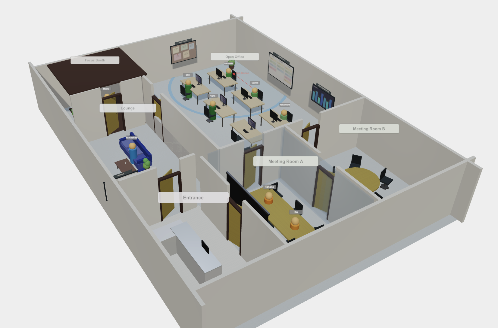
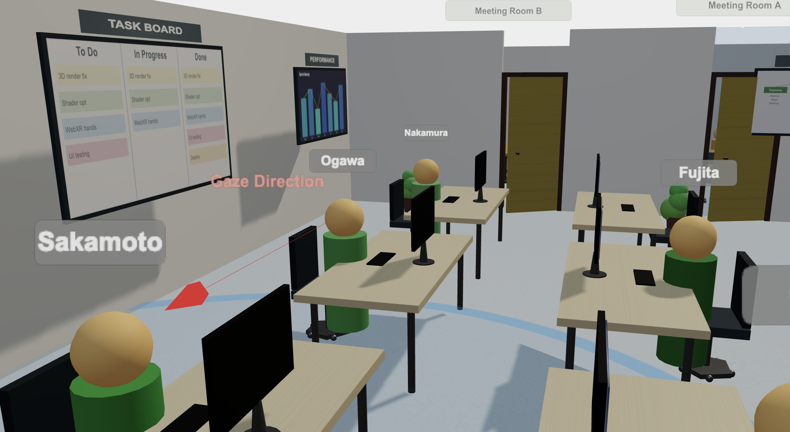

# SCAR: Spatial Context-Aware Retrieval in Virtual Office Environments

This repository contains the simulator, experiment scripts, and result data
for **SCAR**, a platform-agnostic re-ranking framework that fuses four
spatial signals (proximity, gaze direction, location type, temporal decay)
with text similarity in virtual-office information retrieval.

> The accompanying manuscript (under preparation) is not included in this
> repository. The simulator code and experimental data here are provided to
> support reproducibility.

---

## The Virtual-Office Simulator

SCAR is evaluated within a custom virtual-office simulator built with
Three.js. The environment contains six zones (open office, meeting rooms
A/B, focus booth, lounge, entrance), ten AI-driven agents, and multiple
gaze-target objects (task board, bulletin board, performance dashboard,
organisational chart).

### Bird's-eye view



Six zones separated by walls with doorways. Wall-mounted gaze-target
objects feed the GazeBonus signal in the SCAR scoring function.

### First-person view



Red arrow: an agent's gaze directed toward a colleague.
Blue circle: that colleague's proximity radius. Wall objects (task board,
performance dashboard) are potential gaze targets.

---

## Repository Layout

```
SCAR/
├── README.md                     ← this file
├── src/                          ← method implementations
│   ├── sim/                      ← virtual-office simulator + scorer
│   ├── baseline/                 ← LinUCB and other adaptive baselines
│   ├── grid/                     ← weight-tuning grid search
│   ├── noise/                    ← noise-injection module
│   ├── corpus/                   ← corpus ingestion (synthetic + real)
│   └── utils/                    ← shared utilities (RNG, metrics, stats)
├── experiments/                  ← phase runners
│   ├── 01_linucb/                ← LinUCB baseline
│   ├── 03_grid81/                ← weight grid search
│   ├── 04_noise_sweep/           ← noise sensitivity
│   ├── 05_real_corpus/           ← real corpus probe
│   ├── 06_proximity_sweep/       ← proximity-only β sweep
│   └── 07_dense_baseline/        ← BM25 vs Dense × {no spatial, +SCAR}
├── config/                       ← reproducibility configs
│   └── seeds.yaml                ← canonical RNG seeds
├── data/
│   └── results/                  ← experiment JSON outputs
└── docs/
    └── images/                   ← screenshots used in this README
```

## Method Summary

SCAR inserts a lightweight re-ranking step between the embedding-based
retrieval stage and the LLM generation stage of a standard RAG pipeline.
Given query `q`, document `d`, and spatial context `C`, the SCAR score is:

```
S(q, d, C) = α · TextSim(q, d)
           + β · ProxBonus(d, C)
           + γ · GazeBonus(d, C)
           + δ · LocBonus(d, C)
           + ε · TimeDecay(d, C)
```

with default weights `(0.50, 0.20, 0.15, 0.10, 0.05)` selected by simplex
grid search on a held-out validation set.

## How to Run

```bash
git clone https://github.com/RNMUDS/SCAR.git
cd SCAR
python -m venv .venv && source .venv/bin/activate
pip install -r requirements.txt        # if/when added

# Example: run the LinUCB baseline phase
python -m experiments.01_linucb.run --seed 42

# Run the proximity-only β sweep (synthetic + GitHub real corpus)
python -m experiments.06_proximity_sweep.run \
    --betas "0.05,0.10,0.15,0.20,0.25,0.30,0.40,0.50"
```

All experiments write JSON results to `data/results/<exp_id>.json` and use
seeds from `config/seeds.yaml` for reproducibility.

## Local LLM Stack

The simulator and scoring pipeline use Ollama-served local models:

| Role | Model | Note |
|---|---|---|
| Query/document embedding | `nomic-embed-text` v1.5 | 768-dim, ~137M params |
| Answer generation | `mistral` 7B (Q4_K_M) | Quantised for CPU |
| LLM-driven user simulation | `mistral` 7B | Drives agent action selection |

No external API calls are made; the system is designed for BYOC
(Bring Your Own Cloud) deployment.

## Citation

A manuscript reporting the SCAR simulation feasibility study is in
preparation. Citation details will be added here upon publication.

## Acknowledgments

The simulator, experiment scripts, and figure-generation code were
developed with the assistance of Claude (Anthropic) and Claude Code.
Local LLM inference was performed via Ollama. The author retained final
responsibility for all experimental design, statistical analysis, and the
content of any related manuscript.

## License

This project is released under the [MIT License](LICENSE) — copyright (c) 2026
Ryota Nakamura.
